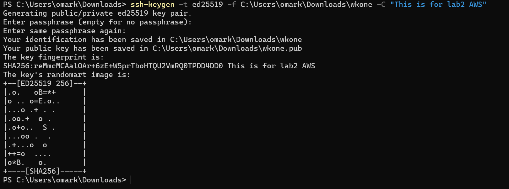
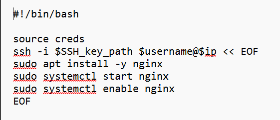

### LAB 2
### MEMBERS
+ Omar
+ Kevin
+ Connor


This is the comand used to generate our ssh Key


Here we first line is the shebang so we are able to use bash script language.<br> Second line is refrencing the creds file that contains th eusername & ip of the AWS vm machine. <br>
```bash
ssh -i $SSH_key_path $username@$ip << EOF
```
This contains the start of the contents of the heredoc to the SSH command.
```bash
sudo apt install -y nginx
sudo systemctl start nginx
sudo systemctl enable nginx
```
These are the commands used to install, start, & enable nginx. We added -y to autoaccpet any promit it gives
```bash
EOF
```
Is the mark to end heredoc


This is the final output of excuting document write
